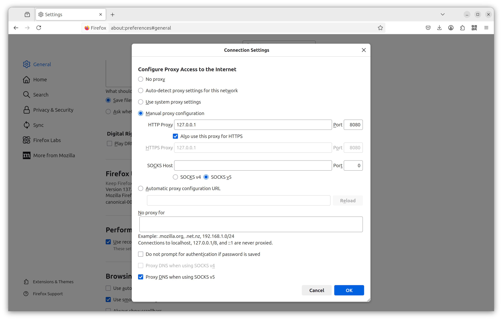

# AntTP

## Background

Autonomi Network (a.k.a. Safe Network) is a distributed data network where both mutable and immutable data can be stored. It can
considered as a best of class web3 experience.

AntTP is a HTTP service which serves data from Autonomi over conventional HTTP connections. This allows regular
web browsers (and other apps) to retrieve data from Autonomi without needing any client libraries, CLIs, etc.

Users can either spin up a local AntTP service or deploy one to a public environment. This enables developers to
integrate with Autonomi in a more conventional way and gives end users a conventional browsing experience.

AntTP was formally known as sn_httpd.

## Features

`AntTP` currently provides the following:

- Data retrieval from Autonomic using archives for human readable naming `/[ARCHIVE_XOR_ADDRESS]/[MY_FILE_NAME]`. Enables
  regular static sites to be uploaded as an archive, with files browsed by file name. E.g.
- http://localhost:18888/91d16e58e9164bccd29a8fd8d25218a61d8253b51c26119791b2633ff4f6b309/autonomi/david-irvine-autonomi-founder.jpg
- Proxy server to allow `http://[ARCHIVE_XOR_ADDRESS]/[MY_FILE_NAME]` to be resolved. Allows
  sites to pivot from a 'root' directory and a smoother user experience. E.g.
- - http://91d16e58e9164bccd29a8fd8d25218a61d8253b51c26119791b2633ff4f6b309/autonomi/david-irvine-autonomi-founder.jpg
- Routing from URLs to specific `[XOR_ADDRESS]` or `[FILE_NAME]`. Enables SPA (single page apps) such as Angular or
  React to be hosted (once a routeMap is provided - see [example-config](resources/app-conf.json)
- Native integration of the `autonomi` libraries into Actix web framework. These are both written in Rust to provide
  smooth integration. As Actix is core to `AntTP`, it can be extended for specific use cases easily.

## Run instructions

List help from binary:

`anttp --help`

```
AntTP is an HTTP proxy which serves data from Autonomi over conventional HTTP connections

Usage: anttp [OPTIONS]

Options:
  -l, --listen-address <LISTEN_ADDRESS>
          [default: 0.0.0.0:18888]
  -s, --static-file-directory <STATIC_FILE_DIRECTORY>
          [default: ]
  -w, --wallet-private-key <WALLET_PRIVATE_KEY>
          [default: ]
  -d, --download-threads <DOWNLOAD_THREADS>
          [default: 8]
  -a, --app-private-key <APP_PRIVATE_KEY>
          [default: ]
  -b, --bookmarks <BOOKMARKS>
          [default: traktion-blog=b70a146f95b3ff237fa8140c4175f6a302c8250fe268aacdb47c2783f2b2ee6af5575410d07f6eae9ac7fb9ce95995e4,imim=959c2ba5b84e1a68fedc14caaae96e97cfff19ff381127844586b2e0cdd2afdfb1687086a5668bced9f3dc35c03c9bd7]
  -u, --uploads-disabled
          
  -c, --cached-mutable-ttl <CACHED_MUTABLE_TTL>
          [default: 60]
  -h, --help
          Print help
  -V, --version
          Print version
```

Run binary with defaults

`anttp`

Build and run from source code:

`cargo run` OR `cargo run -- <args>`

Where arguments are:

- `-l, --listen-address` is the IP address and port to listen on.
- `-s, --static-file-directory` is a directory to host local/static files in.
- `-w, --wallet-private-key` is a secret key for a wallet used for uploads.
- `-d, --download-threads` is the number of parallel threads used for chunk downloads.

## Proxy Configuration

Using AntTP as a proxy is optional, but it improves the user experience.

Configuring AntTP as a proxy is more secure, as it blocks calls out to clear net sites. All traffic is directed to
Autonomi, ensuring no data is leaked beyond AntTP and Autonomi.

Using a proxy also enables shorter URLs, where the target web application XOR is considered the 'host' in a traditional
web sense. For some web applications, this may be a requirement, due to how they route their links.

Configuring a browser to use AntTP as a proxy is easy. Any regular web browser that has proxy settings can be used
(e.g. Firefox) or allows CLI arguments to enable them (e.g. Brave).

### Firefox Configuration

- Go to `Settings` from the burger drop down
- Type 'proxy' in the `Find in Settings` input box
- Click `Settings...` button
- Click `Manual proxy configuration`
- Enter `127.0.0.1` in the `HTTP Proxy` input box and `18888` in the `Port` input box (or whichever non-default IP/port you are using)
- Check the `Also use this proxy for HTTPS` check box
- Check the `SOCKS v5` check box
- Check the `Proxy DNS when using SOCKS v5` check box
- Then click `OK` and start browsing Autonomi over AntTP!

See the example screenshot below:



### Brave Configuration

Brave browser only uses system wide proxy settings, unless it is launched with proxy arguments:

`brave --proxy-server="127.0.0.1:18888" http://a0f6fa2b08e868060fe6e57018e3f73294821feaf3fdcf9cd636ac3d11e7e2ac/BegBlag.mp3`

(or whichever non-default IP/port you are using)

### Security

If you're running AntTP on your own, personal, machine, you can ignore the security warnings for using HTTP. All data
transmitted between your browser and AntTP will remain on your machine only.

If you use a remote AntTP, ensure you use HTTPS, as your data will be transmitted to/from that remote proxy.

## Build Instructions

### Dependencies
On Ubuntu:

Install Rust

`sudo apt-get install rustup`

Download latest stable release:

`rustup default stable`

### Linux Target

It is recommended that the MUSL target is used to prevent runtime dependency issues.

On Ubuntu:

`sudo apt-get install musl-tools`

Then add target:

`rustup target add x86_64-unknown-linux-musl`

Then build release:

`cargo build --release --target x86_64-unknown-linux-musl`

### Windows Target

On Ubuntu:

`sudo apt-get install mingw-w64`

Then add target:

`rustup target add x86_64-pc-windows-gnu`

Then build release:

`cargo build --release --target x86_64-pc-windows-gnu`

### ARM Target

On Ubuntu:

`sudo apt install gcc make gcc-arm* gcc-aarch64* binutils-arm* binutils-aarch64* pkg-config libssl-dev`

Then add target:

`rustup target add arm-unknown-linux-musleabi`
`rustup target add gcc-arm-linux-gnueabi`

Then update the environment:

`export CARGO_TARGET_AARCH64_UNKNOWN_LINUX_MUSL_LINKER=aarch64-linux-gnu-gcc`
`export CC=aarch64-linux-gnu-gcc`

Then build release:

`cargo build --release --target aarch64-unknown-linux-musl`

## Archive Upload

To upload a directory to Autonomi as an archive, do the following:

- `cd your/directory`
- `ant file upload -p <directory>`

This command will return information about the uploads and summarise with something like:

`Uploading file: "./1_bYTCL7G4KbcR_Y4rd78OhA.png"
Upload completed in 5.57326318s
Successfully uploaded: ./
At address: 600d4bbc3d7f316c2fe014ca6986c6ea62200be316e34bd307ae3aa68f8e3cfc`

The 'At address' is the archive address, which you can now reference the uploaded files like:

Via a proxy (to localhost:18888):
`http://a0f6fa2b08e868060fe6e57018e3f73294821feaf3fdcf9cd636ac3d11e7e2ac/BegBlag.mp3` 

Or via direct request:
`http://localhost:18888/a0f6fa2b08e868060fe6e57018e3f73294821feaf3fdcf9cd636ac3d11e7e2ac/BegBlag.mp3`

## Web Application Customisation

See [example-config](resources/app-conf.json) for customising how your website/app behaves on `AntTP`:

```
{
  "routeMap": {
    "": "index.html",
    "blog/*": "index.html",
    "blog/*/article/*": "index.html"
  }
}
```

- Create an app-config.json file in the directory you intend to upload/publish to Autonomi
- Add the `routeMap` key
- Add any routes that should be mapped to a file
  - Use "" as a key to serve the target file for the root URL, e.g. index.html
  - Use "/blog/*" as a key to serve the target file for any URL with blog followed by a filename
  - Use "/blog/*/article/*" as a key to serve the target file for any URL with a blog and article specified
  - The blog/article above are not keywords. Any names can be used to suit the routing approach needed
- Upload the directory as an archive to Autonomi (see above for more details)
  - `ant file upload -p <directory>`
- Browse to the archive XOR address with your browser and confirm the routing is correct
- Why add routes?
  - Many modern frameworks expect all requests to be routed through a single HTML file, which then pull in Javascript
    dependencies, which then handles the routing of your app components. Angular, for example, requires this sort of routing.
  - If you just want an index instead of a file listing being rendered, providing a `routeMap` will also enable this. 
    This is handy when you want a default page/app/script to load for a URL, without needing to specify the filename too.

## PubAnt.com - Publish your Website

For more information on how to publish a website on Autonomi Network, [PubAnt.com](https://pubant.com/) is an excellent resource.

Once your site has been published, it can be accessed through a regular browser, through AntTP.

## Example site - IMIM!

A sister application for AntTP is the IMIM blog. The source code is located at [IMIM](https://github.com/traktion/i-am-immutable-client), and enabled authors 
to write Markup text files and publish them on Autonomi. Using `AntTP`, these blogs can be viewed anywhere that an
instance is running.

IMIM includes examples of route maps and how Angular apps can be integrated with AntTP. It also gives a realistic example
of performance and how immutable file caching can effectively reduce latency to near zero in most cases. IMIM is also
a great place to create a blog.

If your browser is configured as an AntTP proxy, take a look here at an example blog all about Autonomi:

http://62003e683b5a792f425a75c5d7d99d06e80f7047be8de8176b7d295e510b3b4c/blog/705a5fa9b2b2ee9d1ec88f7f6cae45a9e40d4cf8ea202252c9d7e68eb6e17c8b#home

Why not take a look and start your own immutable blog today?

## Roadmap

- [ ] Documentation
  - [x] Basic README
  - [x] Improved README
  - [ ] Add tutorials / API details
  - [ ] Link with IMIM as sample project
- [x] Files
  - [x] Enable file downloads from XOR addresses
  - [x] Enable file downloads from archives with friendly names
- [x] Directories (archives)
  - [x] Enable directory listing in HTML (default)
  - [x] Enable directory listing with JSON (using `accept` header)
  - [x] Enable multiple file uploads as multipart form data
    - Creates an archive, adds the files, then uploads to Autonomi
    - Async operation, with POST for data and GET for status checks
- [x] Caching
  - [x] Cache immutable archive indexes to disk to reduce lookups to Autonomi
  - [x] Set response headers to encourage long term caching of XOR data
  - [x] Add eTag header support to encourage long term caching of all immutable data (with/without XOR)
- [x] Proxy server
  - [x] Resolve hostnames to XOR addresses for files
  - [x] Resolve hostnames to XOR addresses for archives
- [x] Streaming downloads
  - [x] Add streaming support for data requested with RANGE headers
  - [x] Add streaming support for all other data requested
- [ ] Advanced Autonomi API integration
  - [ ] REST API
    - [x] Pointer
    - [x] Scratchpad
    - [ ] Graph
    - [x] Register
    - [x] Chunk
    - [ ] BLS support
      - [ ] Create, sign, verify
      - [ ] Derived keys
    - [ ] Analyze address support
    - [ ] Vault support (CRUD, cost)
    - [ ] Data upload cost
    - [ ] Wallet support
      - [ ] get balance
      - [ ] send tokens
      - [ ] get transaction history
  - [ ] gRPC API
    - [ ] Pointer
    - [ ] Scratchpad
    - [ ] Graph
    - [ ] Register
    - [ ] Chunk (in addition to file support, which is already implemented)
    - [ ] BLS support
      - [ ] Create, sign, verify
      - [ ] Derived keys
    - [ ] Analyze address support
    - [ ] Vault support (CRUD, cost)
    - [ ] Data upload cost
    - [ ] Wallet support
      - [ ] get balance
      - [ ] send tokens
      - [ ] get transaction history
  - [ ] Websockets
    - [ ] Stream immutable data types
    - [ ] Stream changes to mutable data types
- [ ] Testing
  - [ ] Core unit test coverage
  - [ ] Full unit test coverage
  - [ ] Performance testing
- [x] Improve CLI arguments
- [ ] Offline mode (requests without connected client library dependency)
- [ ] Accounting features
  - [ ] Bandwidth usage/tracking
  - [ ] Payments for data uploads (i.e. for public proxies)

## Donations

If you like AntTP and want to support continued development, any tokens would be gratefully received:

ETH, ANT or other ETH based tokens: 0x2662A9d8889678cD46F483C950eDfe344456E04e
