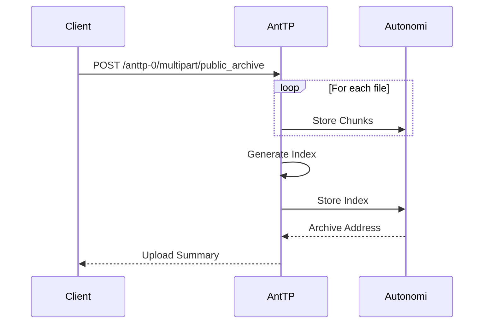
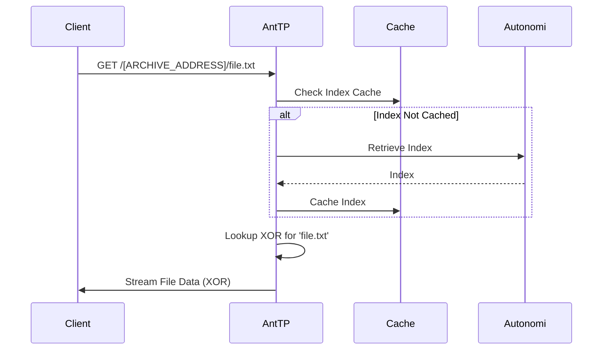

# Archives & Tarchives

Archives are used to group multiple files together on the Autonomi Network, allowing them to be retrieved by name.

## Data Flow

### Create Public Archive
Creating a public archive involves uploading multiple files as `multipart/form-data`. AntTP handles chunking each file and generating an archive index.

### Retrieve from Archive
Retrieving a file from an archive requires fetching the index first.

## API Endpoints

### REST API
*   **Public Archive:**
    *   `POST /anttp-0/multipart/public_archive`: Create a new archive.
    *   `PUT /anttp-0/multipart/public_archive/{address}`: Update an existing archive.
*   **Tarchive:**
    *   `POST /anttp-0/multipart/tarchive`: Create a new tarchive.
    *   `PUT /anttp-0/multipart/tarchive/{address}`: Update an existing tarchive.

### MCP Tools
*   `create_archive`: Creates an archive of files.
*   `update_archive`: Updates an existing archive.

### gRPC API
*   `PutPublicArchive`: Create or update a public archive.
*   `PutTarchive`: Create or update a tarchive.

## Archive Types
*   **Public Archive:** A collection of independent files and an index. Best for general-purpose file hosting.
*   **Tarchive:** A tarball with an appended index. Highly efficient for many small files and maintaining chronological order.

---
[<< Previous](pointers.md) | [Up](../../README.md) | [Next >>](pnr.md)
