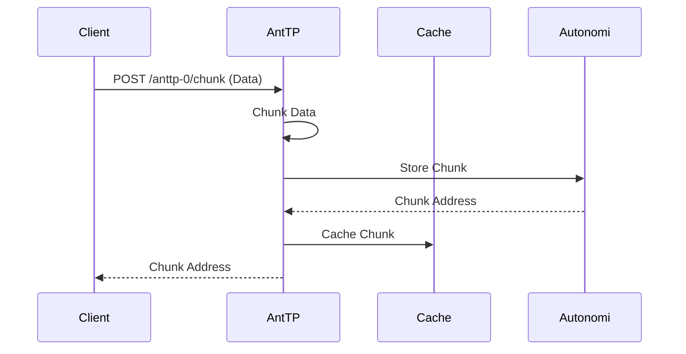
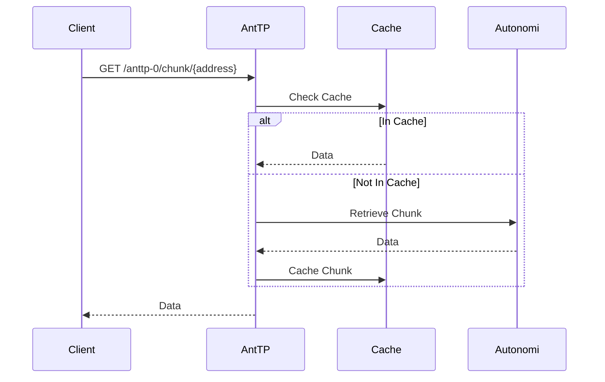

# Chunks

Chunks are the most basic unit of immutable data on the Autonomi Network. Large files are broken down into multiple chunks (typically up to 1MB each) before being uploaded.

## Data Flow

The following diagram illustrates the flow of creating and retrieving a chunk through AntTP.

### Create Chunk Flow

### Get Chunk Flow

## API Endpoints

### REST API
*   `POST /anttp-0/chunk`: Upload a JSON-wrapped chunk.
*   `POST /anttp-0/binary/chunk`: Upload raw binary data to be chunked.
*   `GET /anttp-0/chunk/{address}`: Retrieve a JSON-wrapped chunk.
*   `GET /anttp-0/binary/chunk/{address}`: Retrieve raw binary data.

### MCP Tools
*   `create_chunk`: Creates a new chunk on the network.
*   `get_chunk`: Retrieves a chunk by its address.

### gRPC API
*   `PutChunk`: Uploads a chunk.
*   `GetChunk`: Retrieves a chunk.

## Storage Options (`x-store-type`)
When uploading chunks, you can use the `x-store-type` header to control persistence:
*   `Network`: Upload to the Autonomi Network.
*   `Disk`: Store only in the local AntTP disk cache.
*   `Memory`: Store only in the local AntTP memory cache. As above, but resets on restart.
