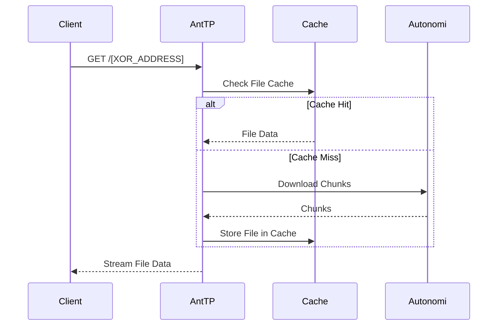
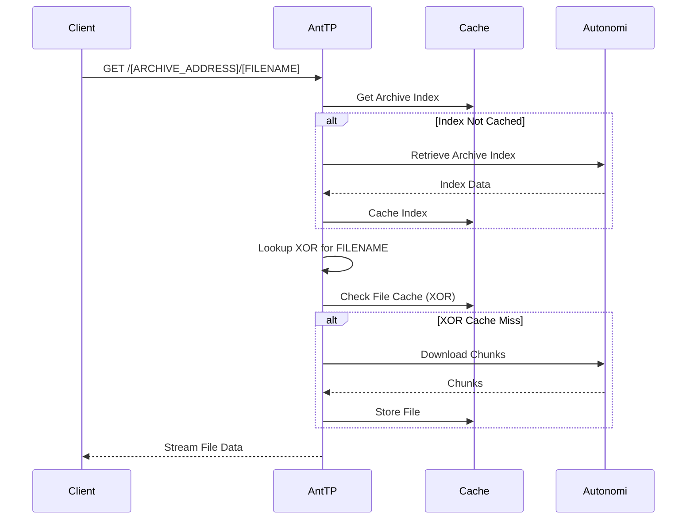

# Files

Files are high-level abstractions over chunks on the Autonomi Network. They allow for the retrieval of data using XOR addresses or through archives with human-readable names.

## Data Flow

### Retrieve File by XOR Address
When a file is requested directly by its XOR address, AntTP downloads the underlying chunks and streams the data back to the client.

### Retrieve File from Archive
When a file is requested from an archive, AntTP first resolves the archive index to find the XOR address of the requested file.

## API Endpoints

### REST API
*   `GET /[XOR_ADDRESS]`: Retrieve a file directly.
*   `GET /[ARCHIVE_ADDRESS]/[FILENAME]`: Retrieve a file from an archive.
*   `GET /[POINTER_ADDRESS]/[FILENAME]`: Resolve pointer and retrieve file.

### MCP Tools
*   `upload_file`: Uploads a file to the network.
*   `download_file`: Downloads a file by its address.

### gRPC API
*   `PutFile`: Uploads a file.
*   `GetFile`: Retrieves a file.

## Features
*   **Streaming:** Large files are streamed to the client to reduce memory usage.
*   **Range Requests:** Supports standard HTTP `Range` headers for partial downloads (useful for video/audio seeking).
*   **Content-Type Detection:** Automatically detects and sets the `Content-Type` header based on the file extension or content.
