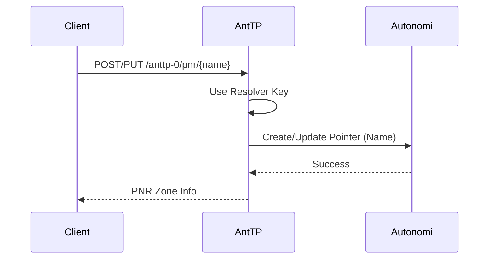
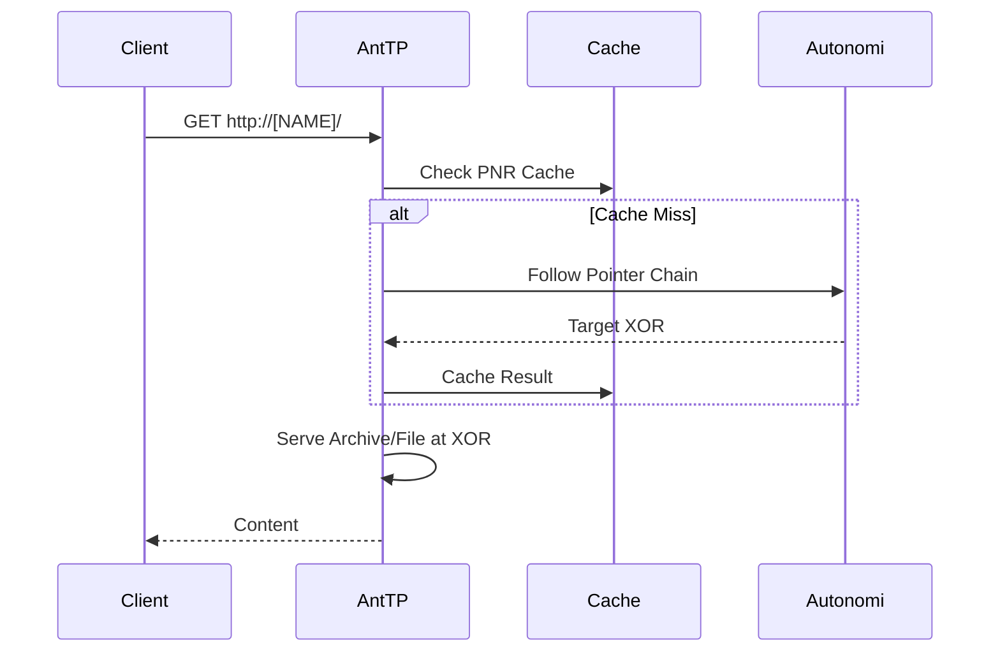

# Pointer Name Resolver (PNR)

The Pointer Name Resolver (PNR) provides human-readable name resolution on the Autonomi Network by utilizing pointer chains.

## Data Flow

### Register/Update Name Flow
Registering a name involves creating or updating a PNR zone (a specialized pointer) using the shared resolver key.

### Resolve Name Flow
When a name is encountered (e.g., in a browser URL), AntTP resolves the pointer chain to find the ultimate target XOR address.

## API Endpoints

### REST API
*   `POST /anttp-0/pnr`: Create a new PNR name registration.
*   `PUT /anttp-0/pnr/{name}`: Update an existing PNR name.
*   `GET /anttp-0/pnr/{name}`: Retrieve the current registration info for a name.

### MCP Tools
*   `create_pnr`: Registers a new name.
*   `update_pnr`: Updates an existing name.
*   `get_pnr`: Retrieves info for a registered name.

### gRPC API
*   `CreatePnr`: Register or update a name.
*   `UpdatePnr`: Updates an existing name.
*   `GetPnr`: Retrieve name registration info.

## Ownership and Chains
PNR names can be transferred between owners. Each transfer adds a link to the pointer chain. AntTP's caching ensures that even long chains resolve quickly after the first lookup.
