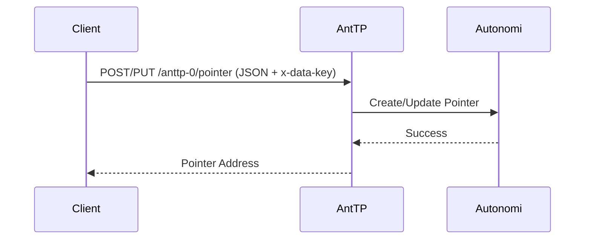
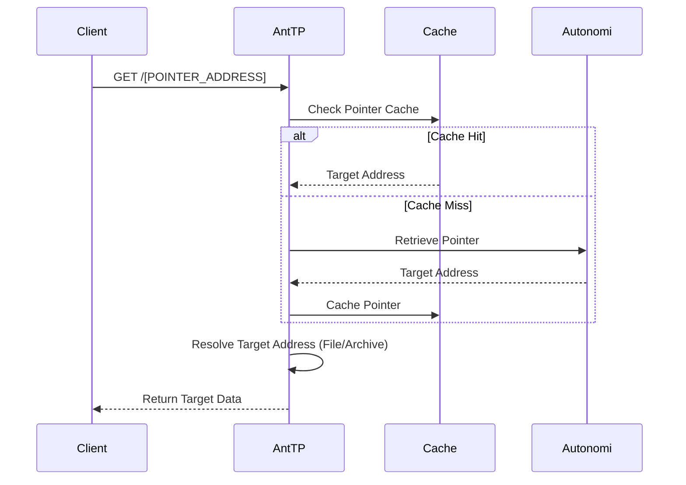

# Pointers

Pointers are a mutable data type on the Autonomi Network that allow you to create a persistent address which can point to any other network address (mutable or immutable).

## Data Flow

### Create/Update Pointer Flow
A pointer is created using a private key (`x-data-key`). Only the holder of this key can update the pointer.

### Resolve Pointer Flow
When AntTP encounters a pointer address in a URL, it resolves it to find the target address it points to.

## API Endpoints

### REST API
*   `POST /anttp-0/pointer`: Create a new pointer.
*   `PUT /anttp-0/pointer/{address}`: Update an existing pointer.
*   `GET /anttp-0/pointer/{address}`: Retrieve the target address of a pointer.

### MCP Tools
*   `create_pointer`: Creates a new pointer.
*   `update_pointer`: Updates an existing pointer.
*   `get_pointer`: Retrieves a pointer by its address.

### gRPC API
*   `PutPointer`: Create or update a pointer.
*   `GetPointer`: Retrieve a pointer.

## Private Keys (`x-data-key`)
When working with pointers, you must specify which private key to use:
*   `personal`: Uses the app private key provided at startup.
*   `resolver`: Uses the PNR shared resolver key.
*   `[Hex String]`: Uses a custom hex-encoded private key.

---
[<< Previous](registers.md) | [Up](../../README.md) | [Next >>](archives.md)
