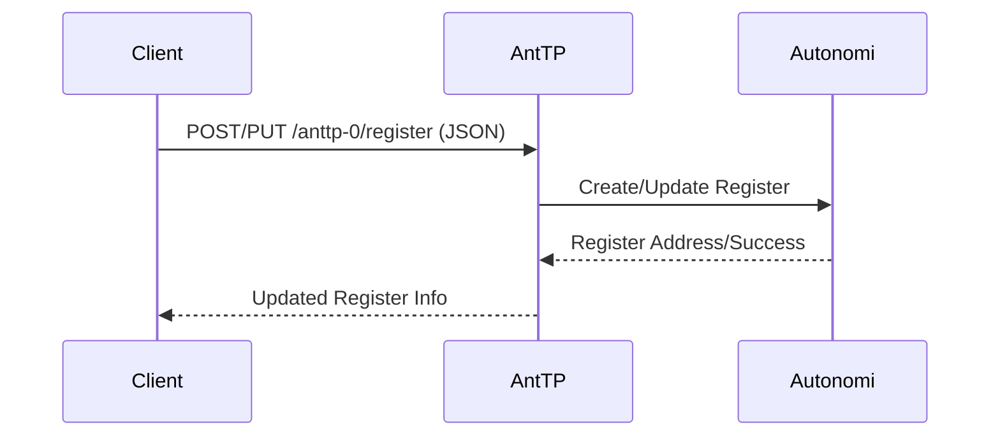
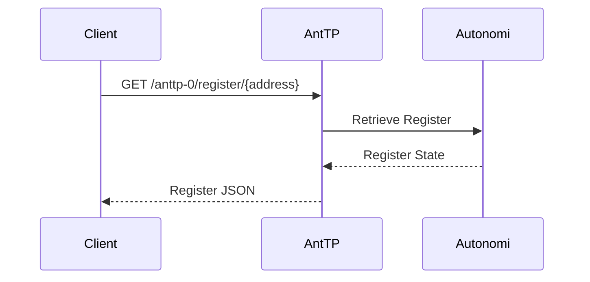

# Registers

Registers are a mutable data type on the Autonomi Network. They act as a distributed, conflict-free replicated data type (CRDT) that stores a set of items.

## Data Flow

### Create/Update Register Flow
Registers are identified by their address. Updating a register involves adding a new entry to the existing register at that address.

### Get Register Flow
Retrieving a register returns its current state or its full history.

## API Endpoints

### REST API
*   `POST /anttp-0/register`: Create a new register.
*   `PUT /anttp-0/register/{address}`: Update an existing register.
*   `GET /anttp-0/register/{address}`: Get the current state of a register.
*   `GET /anttp-0/register_history/{address}`: Get the full history of a register.

### MCP Tools
*   `create_register`: Creates a new register.
*   `update_register`: Updates an existing register.
*   `get_register`: Retrieves the current state of a register.

### gRPC API
*   `PutRegister`: Create or update a register.
*   `GetRegister`: Retrieve a register.

## CRDT Properties
Because registers are CRDTs, they can be updated by multiple parties simultaneously without central coordination, and all replicas will eventually converge to the same state.
